# CS Challenge 2025 - 1
This repository contains all of my solutions for the computer science challenge, developed in c#,
the code works exclusively on the leetcode platform, for a detailed review of my submissions you can access my [leetcode profile].

[leetcode profile]: https://leetcode.com/u/Mateoskix/

## Roman to Integer

### Explanation
The main goal of this problem is to create an algorithm that transforms valid Roman numeral strings into integers. I implemented a dictionary to store the reference values for Roman numerals (e.g., 'I' → 1, 'V' → 5, 'M' → 1000, etc.). Originally, I thought that the best way to explain the relationship between Roman numerals when processing them was based on whether they were divisible by 5. This logic worked well, except when a numeral ended with 'I'. I then asked ChatGPT for an approach that could cover all cases. It suggested using a "greater than" logic to compare the current index with the next one. Finally, I modified the code to check whether the next position is within the string and if the value to the right is greater than the current value (e.g., in "IV"). In that case, the algorithm subtracts the current value; otherwise, it adds it.

### Performance
We loop through the string once and perform constant-time operations with constant values therefore we have:
* Time: O(n)
* Space: O(1)

Leetcode provided the following metrics:

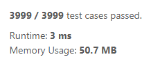

<details><summary><b>Show metrics in-depth</b></summary>

* Runtime:

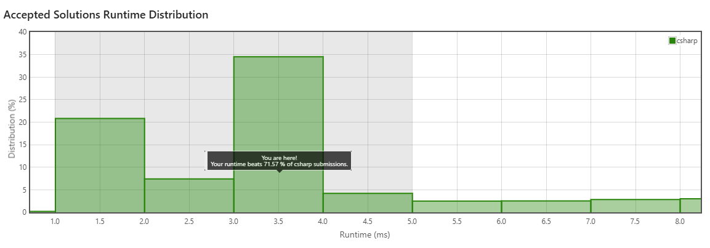

* Memory:

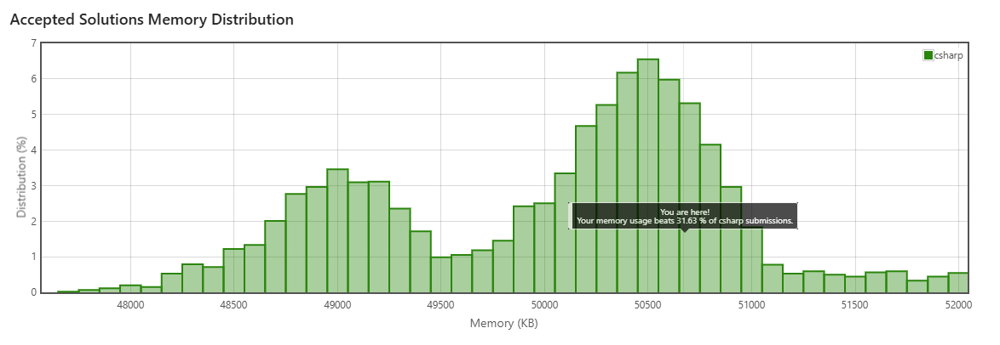

</details>

## Reverse Linked List 1

### Explanation
The problem presents us a class called ListNode that represents a node in a linked list, each object contains a value and a reference to the next node
challenging us to reverse the list (e.g., A → B → C transforms into C → B → A). This was quite a challenge personally because I didn't comprehend how we could swap the link between the current node (head) and the next one without breaking it permanently (something I was doing at the beggining), after diagramming the problem and understanding the need for more than one extra variable, I implemented the solution using a while loop that ends if the current node is null, inside there is a simple swap logic where the next node is stored, it's connection to the current one is broken by connecting to whatever node we stored in a temporal variable and the next node becomes the new head, this way we reconnect through each iteration succesfully reversing the list.

### Performance
Each node is processed once and the support variables are not dependant on the input size, this solution is:
* Time: O(n)
* Space: O(1)

Leetcode provided the following metrics:

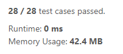

<details><summary><b>Show metrics in-depth</b></summary>

* Runtime:

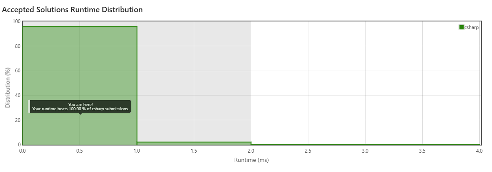

* Memory:

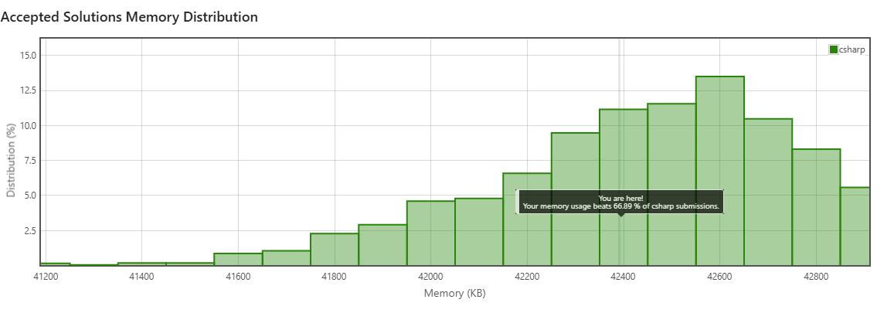

</details>

## Reverse Linked List 2

### Explanation
This is a sequel to the previous problem. Instead of simply reversing the list we have to consider 2 new integers called left and right, these arguments are meant to be boundaries for the reversing (e.g., left: 5, right: 8, means we should only reverse nodes 5 through 8). After fully understanding the first reversed linked list problem the challenge here was figuring out how to iterate the nodes previous to left and how to connect the unreversed nodes with the reversed ones, after researching and asking Chatgpt for help in understanding the task, I implemented a solution where on top of the extra variables introduced in the first part, a "dummy" node was needed for edge cases, such as left being 1, in the code I used 2 loops one that reaches the node previous to left, and a second loop that is identical to the previous challenge, finally a connection between the unreversed list and the reversed part.

### Performance
Both loops depend on the left and right values which in the worst case will be the whole list size:
* Time: O(n)
* Space: O(1)

Leetcode provided the following metrics:

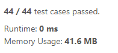

<details><summary><b>Show metrics in-depth</b></summary>

* Runtime:

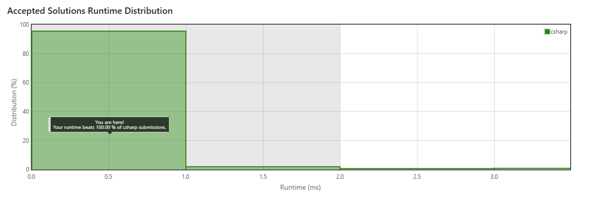

* Memory:

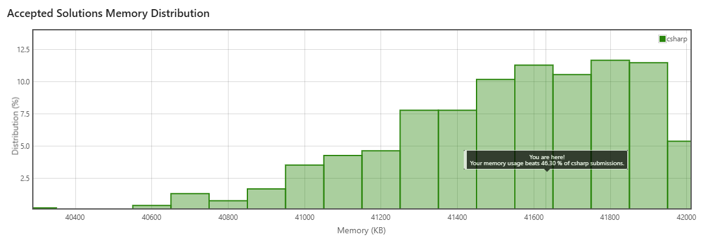

</details>

## Reverse Words in a String

### Explanation
This was the easiest problem for me, the simplest approach was cleaning the original string so that any whitespace becomes a single space, then I used the Split method to create a string array that holds each word, finally arrays in c# have a Reverse method and the only thing left to code is converting from string array to string joining words with a space.

I made 2 submissions to this problem, on my first try I used regular expressions to find any whitespace and remove it
```
text = Regex.Replace(s.Trim(), @"\s+", " ").Split(" ")
```

However this solution had a runtime of 14ms, something I found very odd, after some research I discovered that the Split method has an argument
called StringSplitOptions that processes and replaces the whitespaces too and with a way better runtime (1ms)
```
text = s.Split(" ", StringSplitOptions.RemoveEmptyEntries)
```

### Performance
All methods used are linear and we are creating an array that in the worst case is the same size as the input:
* Time: O(n)
* Space: O(n)

Leetcode provided the following metrics:

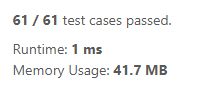

<details><summary><b>Show metrics in-depth</b></summary>

* Runtime:

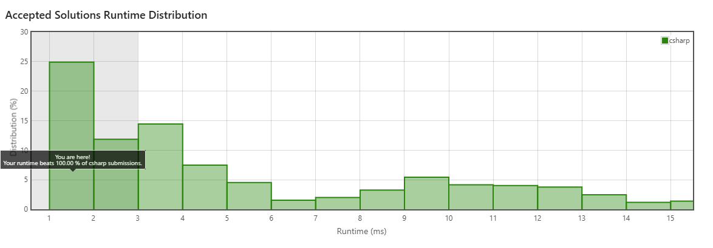

* Memory:

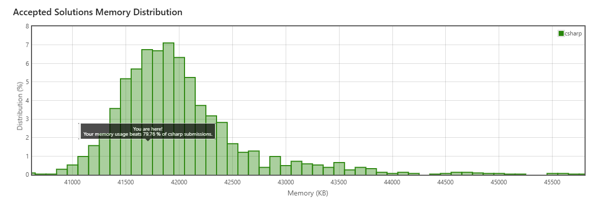

</details>

## Subsets

### Explanation
This problem tasks us with finding all the subsets of a given set (e.g., [1,2] has [1,2],[1],[2],[]), I researched how to approach it because my first quick solution involved using too many loops and checks, I eventually found a tutorial where a special technique called backtracking was employed to solve it, in simple words is treating the problem like a tree where we explore each branch using a back-and-forth algorithm that tries every posibility departing from the tree's root, with this knowledge I implemented a recursive solution where each subset is modified differently in each call and when the leaf is reached (iteration variable equals the length of the main set) the subset is added to the result.

### Performance
The amount of subsets can be calculated with 2^n and in the worst case the subsets reach the size:
* Time: O(2^n*n)
* Space: O(2^n*n)

Leetcode provided the following metrics:

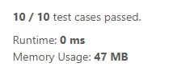

<details><summary><b>Show metrics in-depth</b></summary>

* Runtime:

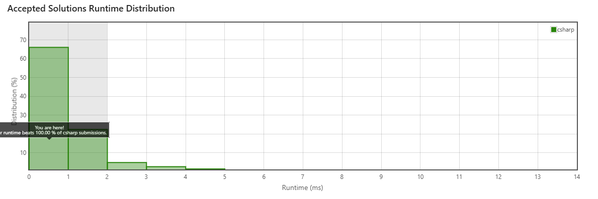

* Memory:

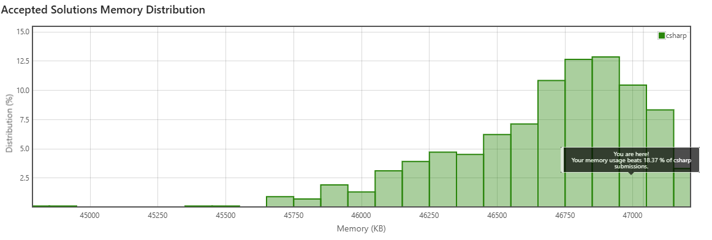

</details>

## Longest Valid Parentheses

### Explanation
This algorithm's goal is to get the largest count of well formated parentheses within a string (e.g., "()())()" = 4 parentheses), I was
really confident because I thought I had understood the problem, the original code used to check in a while loop the current and next indexes looking for a pair of parentheses and if the streak got interrumted it would return the final count value, this was a wrong approach because it just verified the first sequence of parentheses and not the largest, and it also didn't take into account and edge case where nested parentheses exist, I couldn't think of a better solution and asked Chatgpt for insight, it explained that using a stack was perfect for this problem because i could keep an iteration variable and the position of the last unmatched parenthesis, then operate their differance to find the actual length of the largest parentheses sequence.

### Performance
we iterate only once through the string and use constant operations and methods, and we loop through the whole string:
* Time: O(n)
* Space: O(n)

Leetcode provided the following metrics:

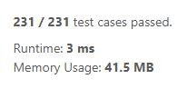

<details><summary><b>Show metrics in-depth</b></summary>

* Runtime:

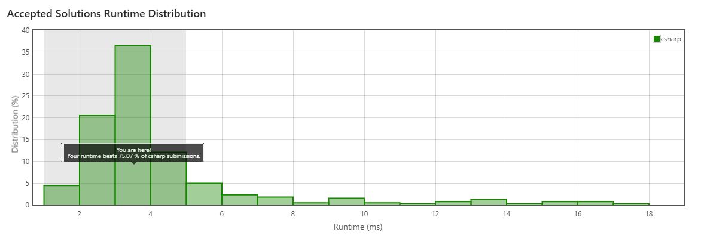

* Memory:

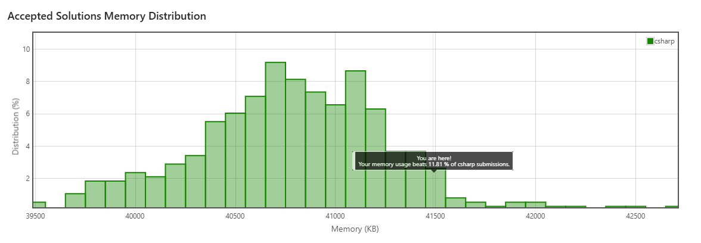

</details>

## Rotate Image

### Explanation
This leetcode asks us to rotate a given matrix 90 degress to the right, while researching and finding that some solutions seemed over complicated, I got reminded by looking at the problem that in Algebra you can achieve similar goals through common operations like matrix transposing and matrix flipping, the final algorithm is very simple, we just iterate through the matrix twice, first we transpose it swaping the values in [i][j] with those at [j][i] and being careful of not transposing anything more than once, in the second iteration we split the matrix and mirror the columns, with these 2 simple operations we can rotate the matrix.

### Performance
The input matrix is computed in 2 nested loops, and the rotation as a whole is made in place:
* Time: O(n^2)
* Space: O(n)

Leetcode provided the following metrics:

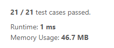

<details><summary><b>Show metrics in-depth</b></summary>

* Runtime:


* Memory:

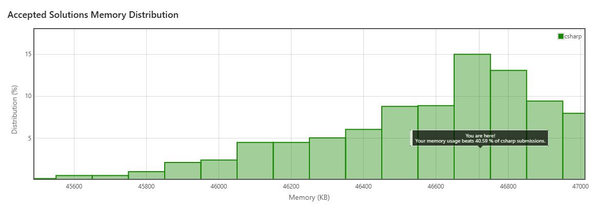

</details>